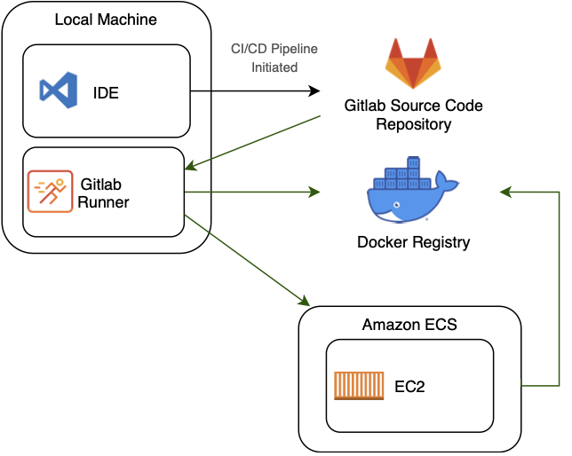

# Simple Flask App with CI/DC Pipeline

This web application is built using the Flask Python famework. The html page is rendered as a template with a view layout and partial views. The page elements are styled using a Bootstrap 4 Bootswatch theme. And the project is able to be deployed in a CI/CD pipeline using Docker (Compose and remote registry), Gitlab (remote repository and local runners) and AWS Elastic Conatiner Services (ECS) and Elastic Cloud Compute (EC2) containers.

### Docker Container
The repository includes a docker-compose file which builds the docker image to run the application. The docker-compose file can be found within the root of the project directory, while the src directory contains its own dockerfile that is used to build the web application - this file structure allows for extension of services offered by the application.

### CI/CD Pipeline
The repository includes a gitlab-ci file. When paired with a registered local gitlab runner, it will continuously integrate the source code when commits are pushed to the remote gitlab repository. The CI pipeline has been seperated into three stages: 1) test 2) build 3) deploy. The test stage is currently empty because there is only a single html end point, however, this is where unit and integration tests would be performed on the source code to test various end points (database connections, APIs, etc.). The build stage will build the latest docker image, and if the build is successful, it will push the image to the remote docker registry. The deploy phase will prompt the elastic cluster service (ECS) to pull the latest docker image from the docker registry and deploy it as the current image; which allows the application to be continously deployed. 

##### Repository Branches
The application hosted on AWS will only be updated when updates are made to the "master" branch in the gitlab repository. This allows for feature development to be continously integrated but not continously deployed into the production envrionment.

### Amazon Web Services
The project is deployed to an EC2 container, which is managed by Amazons Elastic Container Service (a container orchestration service). The gitlab-ci file uses the AWS CLI API provided by Amazon, to update the application running on the EC2 instance.

